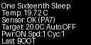
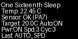
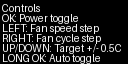

# One Sixteenth Sleep (Flipper Zero App)

Flipper-native controller for Adamson B10 with DS18B20 temperature feedback.

## What This App Does
- Reads DS18B20 water temperature from GPIO `PA7`.
- Shows a live on-device dashboard:
  - current temperature
  - sensor status
  - target temperature
  - auto mode
  - modeled power / fan speed / fan cycle
  - last action
- Sends Adamson B10 IR commands using Flipper IR transmitter (`NECext`, `A:0x4C4D`).
- Supports automatic control to cool toward your target temperature.

## Controls
- `OK` short: Power toggle
- `LEFT` short: Fan speed step (1->2->3->4->1)
- `RIGHT` short: Fan cycle step (1->2->3->4->1)
- `UP` short: Target `+0.5C`
- `DOWN` short: Target `-0.5C`
- `OK` long: Auto mode toggle
- `BACK` short: Exit app

## Auto Policy (v1)
- If `temp <= target`: power off.
- If `temp > target`: power on (if needed), then apply level bands:
  - `0.0 to 0.4C above target` -> level 1
  - `0.4 to 1.2C above target` -> level 2
  - `1.2 to 2.5C above target` -> level 3
  - `>2.5C above target` -> level 4
- Auto actions are rate-limited to avoid command spam.

## Wiring (DS18B20)
Default data pin in app is `PA7`.

Connect:
- DS18B20 `DATA` -> Flipper GPIO `PA7`
- DS18B20 `VCC` -> Flipper `3.3V`
- DS18B20 `GND` -> Flipper `GND`

Notes:
- If your probe breakout/module already includes pull-up, you can wire directly.
- If using a bare DS18B20 sensor (no module), add a `4.7k` pull-up from `DATA` to `3.3V`.

## Build And Install
### 1) Install ufbt
```bash
uv tool install ufbt
```

### 2) Build
```bash
cd "/Users/harryobrien/Documents/Main/Big projects/one sixteenth sleep/one-sixteenth-sleep-flipper"
ufbt fap_one_sixteenth_sleep_flipper
```

### 3) Upload + launch on connected Flipper
```bash
ufbt launch APPSRC=one_sixteenth_sleep_flipper
```

The app is installed to:
- `/ext/apps/GPIO/one_sixteenth_sleep_flipper.fap`

## Validation Scripts
## Python tooling deps
```bash
python3 -m venv .venv
source .venv/bin/activate
python -m pip install -r requirements-dev.txt
```

## ESP IR regression check
Validates ESP-side transmitter output against Flipper capture:
```bash
python tools/verify_esp_ir_with_flipper.py
```

## Flipper input harness
Sends deterministic inputs to the running app via CLI.
Optional: pass ESP port to check `IRRX` logs while actions are sent.
```bash
python tools/flipper_input_ir_harness.py --flipper-port /dev/cu.usbmodemflip_Avalat1
python tools/flipper_input_ir_harness.py --flipper-port /dev/cu.usbmodemflip_Avalat1 --esp-port /dev/cu.usbmodem101 --strict-ir
```

## Generated UI Previews
These are generated previews (not direct device captures):





Generate/regenerate:
```bash
python tools/generate_ui_previews.py
```

## Known Limits
- State is modeled in-app; if a separate remote is used manually, modeled state can drift.
- v1 reads one DS18B20 sensor on fixed pin `PA7`.
